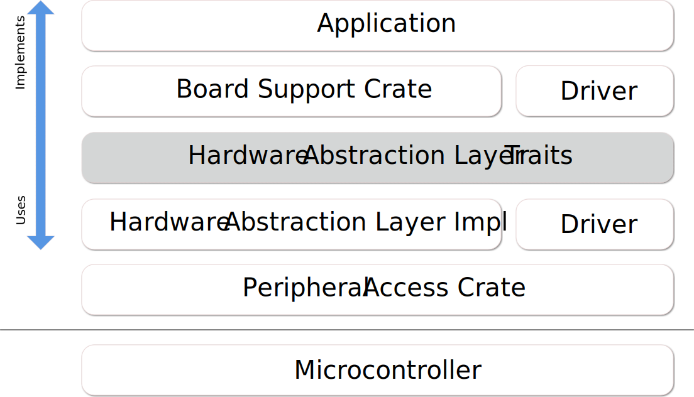

# 可移植性

在嵌入式环境中，可移植性是一个非常重要的主题: 每个供应商甚至同个制造商的每个系列，都提供了不同的外设和功能。同样地，与外设交互的方式也将会不一样。

通过一个被叫做硬件抽象层或者**HAL**的层去均等化这种差异是一种常见的方法。

> 在软件中硬件抽象是一组函数，其模仿了一些平台特定的细节，让程序可以直接访问硬件资源。
> 通过向硬件提供标准的操作系统(OS)调用，它可以让程序员编写独立于设备的高性能应用。
>
> *Wikipedia: [Hardware Abstraction Layer]*

[Hardware Abstraction Layer]: https://en.wikipedia.org/wiki/Hardware_abstraction

在这方面嵌入式系统有点特别，因为我们通常没有操作系统和用户可安装的软件，而是只有固件镜像，其作为一个整体被编译且伴着许多约束。因此虽然维基百科定义的传统方法可能有效，但是它不是确保可移植性最有效的方法。

在Rust中我们要怎么实现这个目标呢?让我们进入**embedded-hal**...

## 什么是embedded-hal？

简而言之，它是一组traits，其定义了**HAL implementations**，**驱动**，**应用(或者固件)** 之间的实现约定(implementation contracts)。这些约定包括功能(即约定，如果为某个类型实现了某个trait，**HAL implementation**就提供了某个功能)和方法(即，如果你要构造一个实现了某个trait的类型，约定保障你肯定有在trait中指定的方法)。

典型的分层可能如下所示:

一些在**embedded-hal**中被定义的traits:
* GPIO (input and output pins)
* Serial communication
* I2C
* SPI
* Timers/Countdowns
* Analog Digital Conversion

出现 **embedded-hal** traits和依赖它们的crates的主要原因是为了控制复杂性。如果你认为一个应用程序可能必须要在硬件中实现外设的使用，以及应用程序和其它硬件组件潜在的驱动，那么其应该很容易被看作是可复用性有限的。用数学语言来说就是，如果**M**是外设HAL implementations的数量，**N**是驱动的数量，那么如果我们要为每个应用重新发明轮子我们最终会有**M*N**个实现，然而通过使用**embedded-hal**的traits提供的 *API* 将会使实现复杂性变成**M+N** 。当然还有其它好处，比如由于API定义良好，开箱即用，导致试错减少。

## embedded-hal的用户

像上面说的，HAL有三个主要用户:

### HAL implementation

一个HAL implentation提供硬件和HAL traits的用户之间的接口。典型的实现由三部分组成:

* 一个或者多个特定于硬件的类型
* 生成和初始化这个类型的函数，其经常提供不同的配置选项(速度，操作模式，使用的管脚，etc 。)
* 与那个类型有关的一个或者多个 **embedded-hal** traits 的 `trait` `impl`

这样的一个 **HAL implementation** 可以有各种类型:
* 通过低级硬件访问，e.g. 通过寄存器。
* 通过操作系统，e.g. 通过使用Linux下的 `sysfs`
* 通过适配器，e.g. 一个与单元测试有关的类型的模仿
* 通过相关硬件适配器的驱动，e.g. I2C多路复用器或者GPIO扩展器(I2C multiplexer or GPIO expander)

### 驱动

一个驱动为一个外部或者内部组件实现了一组自定义的功能，被连接到一个实现了embedded-hal traits的外设上。这种驱动的典型的例子包括多个传感器(温度计，磁力计，加速度计，光照计)，显示设备(LED阵列，LCD显示屏)和执行器(电机，发送器)。

必须使用实现了embedded-hal的某个`trait`的类型的实例来初始化一个驱动，这是通过trait bound来确保的，驱动也提供了它自己的类型实例，这个实例具有一组自定义的方法，这些方法允许与被驱动的设备交互。

### 应用

应用把多个部分结合在一起并确保需要的功能被实现。当在不同的系统间移植时，这部分的适配是花费最多精力的地方，因为应用需要通过HAL implementation正确地初始化真实的硬件，而且不同硬件的初始化也不相同，甚至有时候差别非常大。用户的选择也在其中扮演了非常重大的角色，因为组件能被物理连接到不同的端口，硬件总线有时候需要外部硬件去匹配配置，或者用户在内部外设的使用上有不同的考量。
